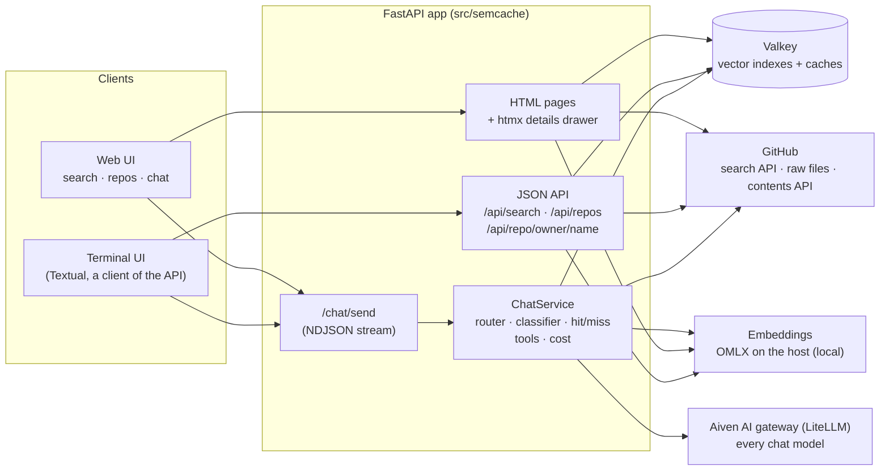
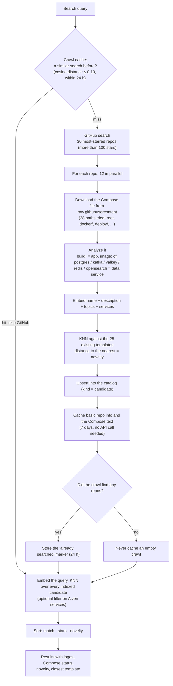
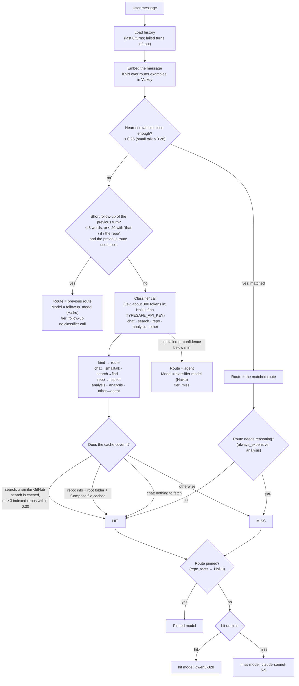
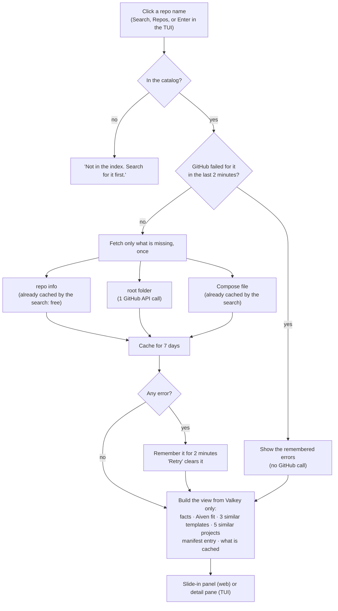
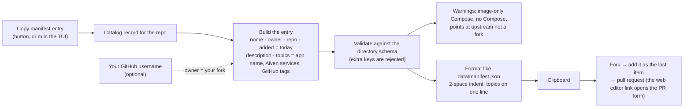

# Template Scout: how the app flows

Template Scout finds open-source projects that could become templates on
[templates.aiven.io](https://templates.aiven.io). Valkey is both the vector search engine and
the cache. This page is drawn from the code; each diagram names the module it comes from.

Contents: [System](#1-the-system) · [Search](#2-search-and-the-semantic-cache) ·
[Chat decision](#3-chat-which-model-answers) · [One chat turn](#4-one-chat-turn-in-order) ·
[Repo panel](#5-the-repo-details-panel) · [Manifest entry](#6-copy-manifest-entry) ·
[Stores](#7-what-lives-in-valkey) · [Models](#8-every-model-and-when-it-runs) ·
[Known limits](#9-known-limits)

---

## 1. The system



The terminal UI holds no secrets and no model access: it calls the same API, so it also works
against a deployed copy.

---

## 2. Search and the semantic cache

`GET /` and `GET /api/search` (`app.run_search`, `github.discover`, `app._crawl`).



---

## 3. Chat: which model answers

`ChatService._decide` (`chat.py`, `decide.py`, `routes.py`). **A hit gets the cheapest model, a miss
gets the expensive one.**



The model names above are today's `settings.toml`. Every chat model is on the Aiven gateway.

---

## 4. One chat turn, in order

```mermaid
sequenceDiagram
  autonumber
  participant U as User (web or TUI)
  participant A as ChatService
  participant V as Valkey
  participant E as Embeddings (OMLX)
  participant G as Aiven gateway
  participant H as GitHub

  U->>A: POST /chat/send {conversation_id, message}
  A->>V: history (conv:id list)
  A->>E: embed(message)
  A->>V: KNN over router examples
  opt nothing matched and not a follow-up
    A->>G: classifier call (Jev; Haiku without a key)
    G-->>A: kind (Jev) or {"kind", "query", "repo"} (Haiku)
  end
  A->>V: cache checks (crawl cache, index coverage, repo cache)
  A-->>U: event meta: tier, model, reason

  opt first message, route lookup or analysis
    A->>V: answer-cache lookup (distance ≤ 0.08)
    V-->>A: cached answer (if any)
    A-->>U: replay it, cost = classifier only
  end

  A->>V: context: templates and top indexed repos
  loop model rounds (max 4 tool steps)
    A->>G: stream (chosen model, tools bound)
    G-->>A: tokens and/or tool calls
    A-->>U: event token / tool / tool_result
    opt tool call
      A->>V: repo cache (info, folders, files)
      A->>H: only if not cached (search, raw file, folder listing)
    end
  end

  A->>V: save turn (answer, route, model, tools, cost)
  A->>V: stats:cost totals
  A->>V: answer cache store (lookup and analysis only)
  A-->>U: events cost, suggestions, done
```

---

## 5. The repo details panel

`GET /repo/{owner}/{name}` (htmx drawer) and `GET /api/repo/{owner}/{name}` (`details.py`).



Opening the details never calls GitHub twice for the same piece of data. In the TUI details load on
Enter only, never as the cursor moves.

---

## 6. Copy manifest entry

`GET /manifest-entry?repo=owner/name[&owner=you]` (`manifest.py`). No model is involved.



---

## 7. What lives in Valkey

| Key prefix / index | What | Written by | Lifetime |
|---|---|---|---|
| `idx:catalog` over `catalog:*` | Existing templates, discovered repos (`candidate`), router examples (`route`); each has a 1024-d embedding | startup, every search | no expiry |
| `idx:crawlcache` over `crawlcache:*` | "This topic was searched" markers, matched by meaning | search | 24 h |
| `idx:chatcache` over `chatcache:*` | First-message answers for `lookup` and `analysis`, matched by meaning | chat | 24 h |
| `conv:<id>` | One conversation: turns, route, model, tools, cost, suggestions | chat | 7 days idle |
| `repocache:info / ls / file / fail` | Repo info, folder listings, files; remembered GitHub failures | search, panel, chat tools | 7 days (search and panel), 1 h (chat reads), 2 min (failures) |
| `stats:cost` | Running spend and savings totals | chat | no expiry |

Search can be tuned in `settings.toml`: every distance, TTL, price and model named above.

---

## 8. Every model and when it runs

| Model | Role | Runs when | Where |
|---|---|---|---|
| Qwen3-Embedding-0.6B | embeddings (1024-d) | every message (route lookup, answer-cache lookup, search coverage), every repo ingested | OMLX on the host, **not** the gateway |
| `qwen3-32b` | **hit** | the router matched, or the cache covers the message (and the route is not pinned or always-expensive) | gateway |
| `jev-latest` | **classifier** | the router matched nothing and it is not a short follow-up | TypeSafe API (`TYPESAFE_API_KEY`) |
| `claude-haiku-4-5` | classifier fallback | no TYPESAFE_API_KEY, or the agent answer when Jev fails or is unsure | gateway |
| `claude-haiku-4-5` | follow-up and pinned `repo_facts` | short follow-ups; router-matched repo-fact questions | gateway |
| `claude-sonnet-5-5` | **miss** | live GitHub data or reasoning is needed: `analysis` always, uncached searches, uncached repo questions, open-ended | gateway |
| *(none)* | answer cache | the first message repeats an earlier `lookup` or `analysis` question | Valkey |

Prices in the cost readout are estimates in `settings.toml` (the gateway publishes none), and
"saved by routing" is a counterfactual against the miss model, not a bill.

---

## 9. Known limits

- **No failover.** If the chosen model errors, the turn ends with an error; it is not retried on
  another model. Only a failed classifier falls back (to Haiku with tools).
- **Repo questions are expensive when nothing is cached.** A question like "what license does Dify
  use?" is a miss until the repo's root folder is cached, so it runs on Sonnet even though the
  license is already stored.
- **The classifier runs before the answer-cache lookup**, so a cached analysis still pays for it.
  Its cost is now counted.
- **Embeddings are the one local dependency.** The gateway has no embeddings endpoint, which blocks
  deploying on Aiven Runtime until embeddings move somewhere Aiven can reach.
- Hit and classifier quality come from small models; the chat tests cover routing and cost, not the
  wording of answers.
